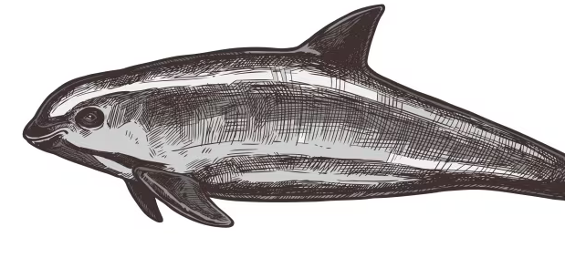
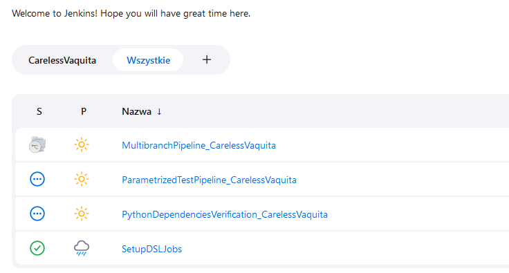

<h2>What is <i>CarelessVaquita</i></h2>  
Careless Vaquita is an <i>open source project base template with ready to go CI/CD setup.</i> It is strongly targeted for Python developers, but with sufficient knowledge and ease, programmers of other languages ​​should have no problem adapting this solution to their needs, because this project only outlines good practices.
Currently supported tools and versions:

- Jenkins 2.445 
  - additional plugins listed in casc/plugins.txt

- Python 3.9.18+ 
  - requirements listed in requirements.requirements-testing.txt

- Docker 24.0.0+ & DockerCompose 2.22.0

- Unix shell 5.0.0+

- githooks 2.43.0+

- groovy 4.0.18+

<h2>About Vaquita</h2>  
Vaquita <i>(Phocoena sinus)</i> has a small body with an unusually tall, triangular dorsal fin, a rounded head, and no distinguished beak. 
The coloration is mostly grey with a darker back and a white ventral field. Prominent black patches surround its lips and eyes. 
Vaquitas reproduction time is very long as they reach sexual maturity from six years old. 
Their pregnancies last from 10 to 11 months, and vaquita calves are nursed by their mothers for 6-8 months until becoming independent. 
In 2023, it was estimated that there are as few as 10 in the wild. 
The drastic decline in vaquita population is the result of fisheries bycatch in commercial and illegal gillnets, including fisheries targeting the now-endangered Totoaba, 
shrimp, and other available fish species.
This animal was chosen as mascot for this project to raise awareness, that there are species critically endangered in the world which the exact number is not precisely 
known and the moment of extinction will likely go completely unnoticed, but commercial massive fishing that bypasses government regulations will stay intact.



<i>source:</i> [Vaquita - Wikipedia](https://en.wikipedia.org/wiki/Vaquita)

<h2>How to setup</h2>
<h3>Step-by-step with sources</h3>   

- Fork [CarelessVaquita](https://github.com/mcieciora/CarelessVaquita). source: [fork a repository](https://docs.github.com/en/pull-requests/collaborating-with-pull-requests/working-with-forks/fork-a-repo)

- Setup git flow. source: [Atlassian - Gitflow workflow](https://www.atlassian.com/git/tutorials/comparing-workflows/gitflow-workflow)

<h3>Step-by-step with commands (suggested)</h3>
<h4>Fork part</h4>

- Create empty GitHub repository and clone it:

```
git clone <empty_repository_url> && cd <empty_repository_url>
```

- Sync upstream of your repository to CarelessVaquita

```
git remote add upstream https://github.com/mcieciora/CarelessVaquita.git
```

- Pull changes from upstream master branch

```
git pull upstream master --allow-unrealted-histories
```

- Set your repository origin header to master

```
git push origin master
```

- Remember to pull from time to time

```
git pull upstream master
```

<h4>Gitflow part</h4>

- Initialize git flow

```
git flow init
```

- Map local master branch to remote master branch

```
git push --set-upstream origin master
```

- Map local development branch to remote development branch

```
git checkout develop && git push --set-upstream origin develop
```

- Feature start/finish flow:

```
git flow feature start <feature_name>

touch my_file.txt

git add my_file.txt

git commit -m 'my_file added'

git push --set-upstream origin feature/<feature_name>

git push

git flow feature finish feature_name

git push
```

<h2>How to begin</h2>

<h3>SetupDSLJob</h3>

After logging into your Jenkins instance there should be already one job ready to trigger, called "SetupDSLJobs". It will fail during first execution, because you need to go to Manage Jenkins > In-process Script Approval and Approve all pending scripts. When it is done Build SetupDSLJobs with parameters, put your project name, GitHub url, and it will generate three base pipelines and one view that contains all of them in one place.




Happy Vaquiting ;)  

<i>mcieciora</i>
